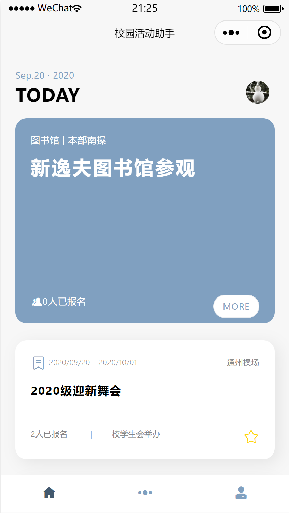
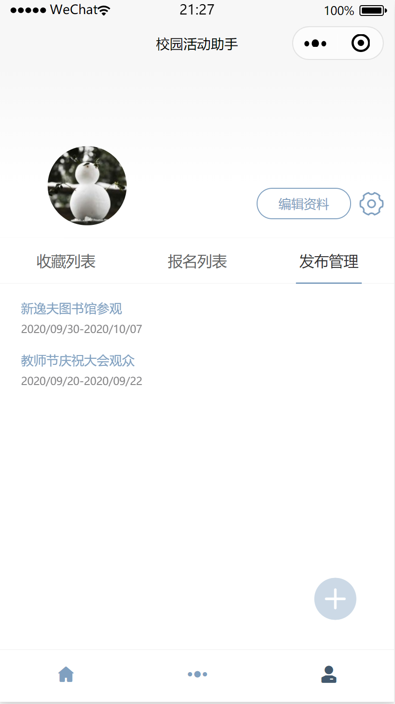
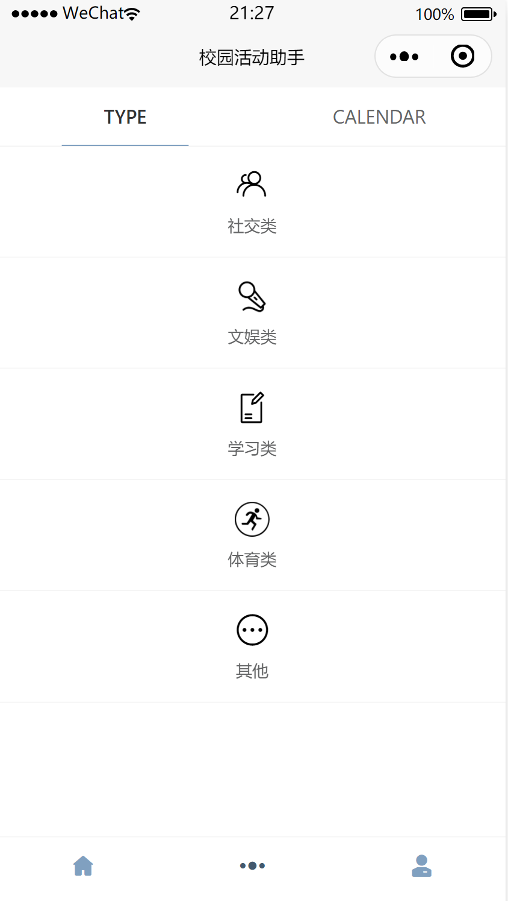
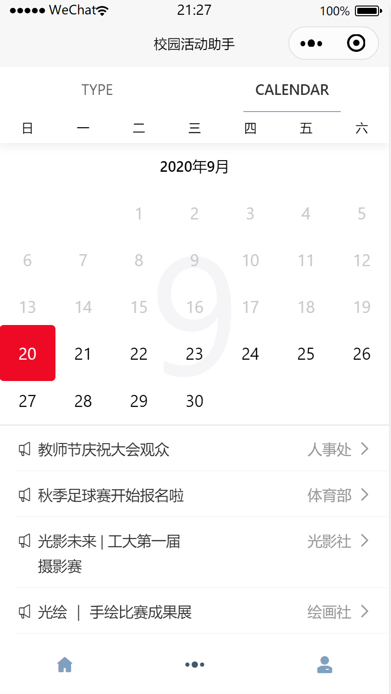

# 活动助手Activity Helper

微信小程序云开发挑战赛参赛作品

参赛团队：工大小分队

## 项目名称

活动助手Activity Helper

## 项目介绍

在高校，各个学生社团和学生组织都会在各个时间发布各式各样的活动信息，但是目前缺乏一个可靠、同一、简便的平台汇总各类的活动信息。《BJUT活动助手》是基于北京工业大学校园内的各项信息开发的一款集报名、统计、汇总、收藏于一体的活动助手小程序，旨在帮助高校统筹管理各类校园活动，以提升学生和老师的活动参与度。

## 项目效果截图

## 项目体验小程序二维码

后台内容管理系统：https://x1-vgiba-1302076395.tcloudbaseapp.com/tcb-cms/

管理者用户名密码：admin/admin

运营者用户名密码：user/user

## 部署教程

部署方式及后端相关服务说明见[deployment.md](./deployment.md)。

## 开源许可

《活动助手Activity Helper》源代码基于 `GPL-3.0` 协议开源，可用于商业用途。点击 [LICENSE](./LICENSE) 查看许可协议。
